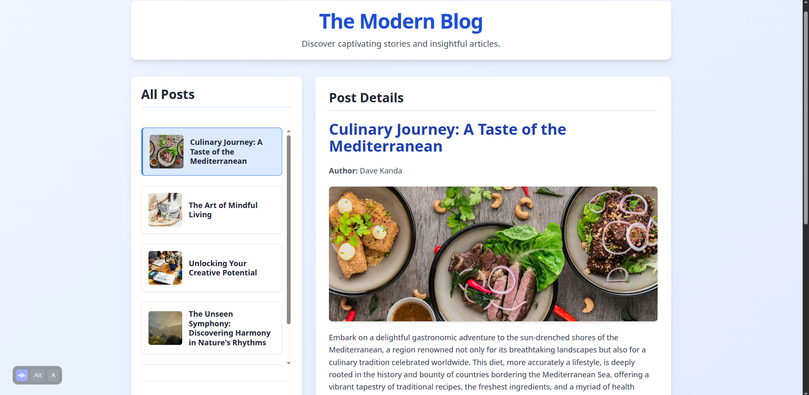

# The Modern Blog
A dynamic, interactive blog application built with HTML, CSS, and JavaScript, featuring a mock backend with JSON Server.

By David Chumo

## Description
This is a minimalist, yet robust, blog post management application. It's designed to showcase fundamental web development concepts including asynchronous data fetching, DOM manipulation, event handling, and dynamic content updates using vanilla HTML, CSS, and JavaScript. The application leverages JSON Server to simulate a backend API, allowing users to perform CRUD (Create, Read, Update, Delete) operations on blog posts with persistence.

## Screenshot

## Features
View All Posts: See a comprehensive list of all blog post titles and associated images when the page loads.

View Post Details: Click on any post title to view its full details, including the title, content, author, and a larger image, displayed dynamically without a page reload.

Add New Posts: Easily create and add new blog posts by providing a title, content, author, and an optional image URL through a dedicated form. New posts are immediately added to the list and persisted to the backend.

Edit Existing Posts: Modify the title and content of any existing blog post using an editable form in the detail section. Changes are updated on the UI and persisted to the backend.

Delete Posts: Remove posts from the list and the backend with a simple click of a dedicated delete button.

Responsive Design: The application features a clean, modern, and interactive user interface designed to adapt gracefully to different screen sizes, ensuring a great experience on desktop, tablet, and mobile devices, thanks to Tailwind CSS.

Client-Side Operations: All DOM manipulations and content updates occur smoothly without requiring a full page reload, providing a seamless user experience.

## How to Use
### Requirements
A computer with Node.js installed (for npm commands).

Access to the internet.

A modern web browser (e.g., Chrome, Firefox, Edge, Safari).

A code editor (VS Code recommended).

Terminal/Command Line.

### View Live Site
Visit the deployed application at: https://kandadave.github.io/The_Modern_Blog/

Ensure that the JSON server is running when accessing the live site. You can follow the steps on how to run the JSON server in the local development section below(from installing JSON server to starting the backend JSON server).

The live site allows you to:

Add new blog posts.

View details of any post by clicking its title.

Edit post titles and content.

Delete posts.

### Local Development
If you want to run the project locally, follow these steps:

#### Installation Process

Clone this repository using:

git clone https://github.com/kandadave/The_Modern_Blog

or by downloading a ZIP file of the code.

Navigate to the project directory:

cd Code-Challenge-2

Install JSON Server: This will act as your mock backend API.

npm install -g json-server@0.17.4

Install Live Server: This will serve your frontend files.

npm install -g live-server

Start the Backend (JSON Server): Open your terminal in the project directory and run:

json-server db.json

This will start the mock API, usually accessible at http://localhost:3000. Keep this terminal window open.

Start the Frontend (Live Server): Open a new terminal window in the project directory and run:

live-server

Your default web browser should automatically open the index.html file, typically at http://127.0.0.1:8080 or http://localhost:8080.

Alternatively, if you use VS Code, you can install the "Live Server" extension and click "Go Live" from the bottom bar while index.html is open.

## Technologies Used
HTML5: For structuring the web content.

CSS3: For styling and creating the appealing, responsive layout, primarily using Tailwind CSS.

JavaScript (ES6+): For all interactive functionalities, DOM manipulation, and asynchronous operations (using Fetch API with Promises).

JSON Server: A lightweight server used to create a fake REST API quickly, providing persistence for blog posts to the db.json file.

## Support and Contact Details
If you have any questions, suggestions, or need assistance, please contact:

Email: david.chumo@student.moringaschool.com

### License
MIT License Copyright © 2025 David Chumo

Permission is hereby granted, free of charge, to any person obtaining a copy of this software and associated documentation files (the "Software"), to deal in the Software without restriction, including without limitation the rights to use, copy, modify, merge, publish, distribute, sublicense, and/or sell copies of the Software, and to permit persons to whom the Software is furnished to do so, subject to the following conditions:

The above copyright notice and this permission notice shall be included in all copies or substantial portions of the Software.

THE SOFTWARE IS PROVIDED "AS IS", WITHOUT WARRANTY OF ANY KIND, EXPRESS OR IMPLIED, INCLUDING BUT NOT LIMITED TO THE WARRANTIES OF MERCHANTABILITY, FITNESS FOR A PARTICULAR PURPOSE AND NONINFRINGEMENT. IN NO EVENT SHALL THE AUTHORS OR COPYRIGHT HOLDERS BE LIABLE FOR ANY CLAIM, DAMAGES OR OTHER LIABILITY, WHETHER IN AN ACTION OF CONTRACT, TORT OR OTHERWISE, ARISING FROM, OUT OF OR IN CONNECTION WITH THE SOFTWARE OR THE USE OR OTHER DEALINGS IN THE SOFTWARE.
